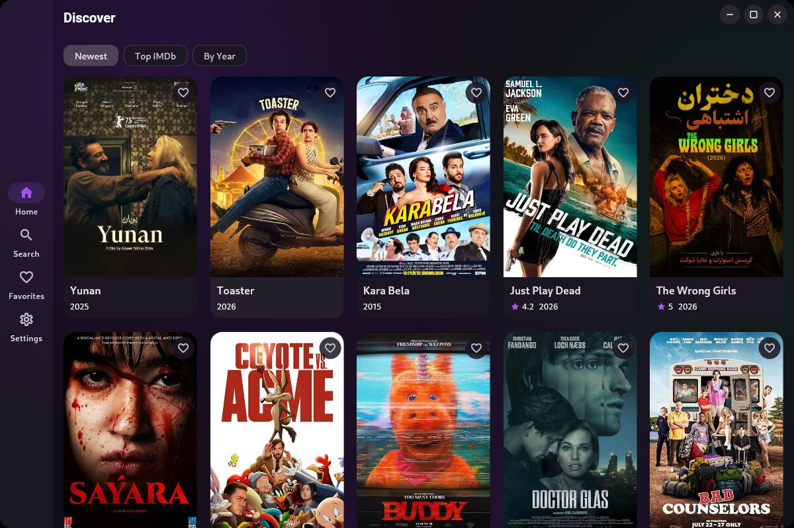
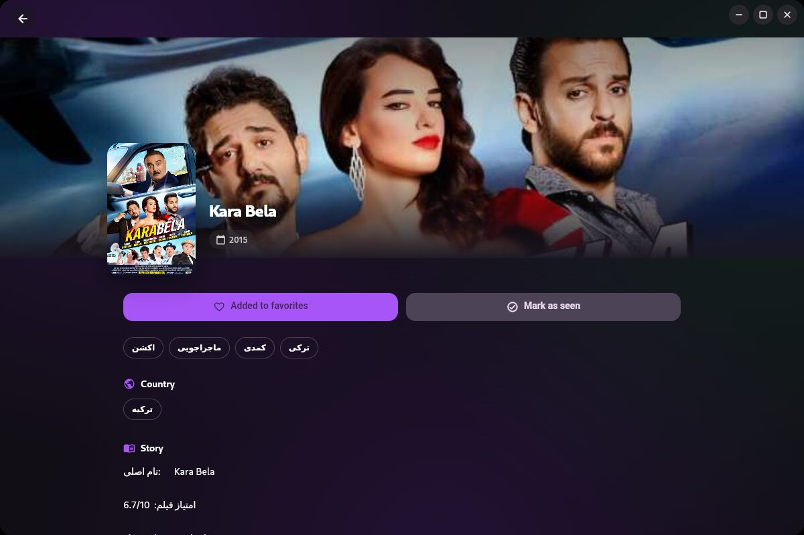

# Filmify

Bilingual (English / فارسی) movie discovery & download hub — a Flutter app for
Android, Linux and Windows. Successor to the `a-movie` project, talking to the
same upstream movie API.

<p align="center">
  
  &nbsp;
  
</p>

## Download

Grab the latest release for your platform. The links below always point to the
newest version — no need to check versions manually. The app also checks for
updates on startup and can install them for you (toggle it in **Settings →
Updates**).

### Android

> **Tip:** Most phones (including Samsung A-series, Galaxy S-series, Pixel, Xiaomi,
> OnePlus…) use **arm64-v8a**. If the arm64 APK won't install (very old 32-bit
> device), use armeabi-v7a.

| Device type | Package | Download |
| --- | --- | --- |
| Most phones (arm64) | APK | [Download for Android (arm64-v8a)](https://github.com/mst-ghi/filmify/releases/latest/download/Filmify-android-arm64-v8a.apk) |
| Older 32-bit phones | APK | [Download for Android (armeabi-v7a)](https://github.com/mst-ghi/filmify/releases/latest/download/Filmify-android-armeabi-v7a.apk) |
| Emulators (x86_64) | APK | [Download for Android (x86_64)](https://github.com/mst-ghi/filmify/releases/latest/download/Filmify-android-x86_64.apk) |

**Install:** tap the downloaded `.apk` file (or open it from your Downloads
folder). If Android asks, allow "Install unknown apps" for your file manager or
browser — this is normal for apps not distributed through the Play Store.

### Windows

| Package | Download |
| --- | --- |
| Installer (recommended) | [Download for Windows (setup.exe)](https://github.com/mst-ghi/filmify/releases/latest/download/Filmify-windows-x64-setup.exe) |
| Portable (no install) | [Download for Windows (zip)](https://github.com/mst-ghi/filmify/releases/latest/download/Filmify-windows-x64.zip) |

**Install:** run the `setup.exe` and follow the wizard — it installs a shortcut
and handles updates on reinstall. The zip is a self-contained build: extract and
run `Filmify.exe`.

### Linux

| Package | Download |
| --- | --- |
| Debian / Ubuntu / Mint | [Download .deb](https://github.com/mst-ghi/filmify/releases/latest/download/Filmify-linux-amd64.deb) |
| Fedora / openSUSE / RHEL | [Download .rpm](https://github.com/mst-ghi/filmify/releases/latest/download/Filmify-linux-x86_64.rpm) |
| Portable (any distro) | [Download tar.gz](https://github.com/mst-ghi/filmify/releases/latest/download/Filmify-linux-x64.tar.gz) |

**Install:** `sudo apt install ./Filmify-linux-amd64.deb` (or `sudo dnf install`
for the rpm). The tar.gz is portable: extract and run `filmify` from the
`bin/`-free folder — it bundles everything it needs.

## Features

- **First-run onboarding** — a welcome screen where you pick your language,
  accent color, theme and a few preferences before diving in. Replay it
  anytime from **Settings → About → Show welcome again**.
- **Discover** — newest / top-rated / by-year filters, infinite scroll, shimmer
  skeletons, pull-to-refresh.
- **Search** — debounced live search with persisted recent-query history.
- **Details** — cover backdrop, genres, rating/duration/year, description and
  download sources with open-in-download-manager, copy and share actions.
- **Built-in player** — tap a download source to preview the video in a
  full-window player (mpv/libmpv under the hood).
- **Favorites & Seen** — favorite movies and mark seen movies (green badge on
  cards). Both work offline.
- **Settings** — dark/light/system theme, English/Persian/system language,
  Persian numerals toggle, automatic-update toggle, version info.
- **Automatic updates** — the app checks for new versions on startup; when one
  is available an icon appears next to the window controls (desktop) or in the
  top corner (phone), showing the download percentage live. You can also check
  and update from **Settings → Updates**.
- **Bilingual & RTL** — full Persian translation with right-to-left layout.
- **Micro-interactions** — animated gradient-mesh background, hero poster
  transitions, heart-burst on favorite, animated seen badge.
- **Native desktop feel** — frameless window with custom controls and draggable
  title bar on Linux/Windows.
- **Download-manager friendly** — direct links open via the platform handler,
  so IDM/aria2/xdm/ADM-style managers pick them up.

Movies without a download link are hidden, so you only see things you can
actually grab.

## FAQ

**How do updates work?**
The app compares its version to the latest release on startup (if **Automatic
updates** is on). When a new version exists, a small update icon appears; tap it
to see the progress and install. On Windows it runs the installer; on Android it
opens the system package installer. On Linux it opens the releases page.

**Is it an ad or a virus?**
No — the app is open source. The update icon is Filmify telling you a new
version is ready.

**Do I need an account?**
No. Everything works without signing up.

**Why do I get "Install unknown apps"?**
Filmify isn't on the Play Store, so Android shows this once per install. It's
safe — you choose to allow it.

**I can't see some movies anymore.**
Movies without downloadable sources are hidden by design.

**Is my data stored anywhere?**
No. Favorites, seen history and settings live only on your device.

## Building from source

```sh
flutter pub get
flutter run            # debug on the connected device
flutter build apk --release --split-per-abi
flutter build linux --release
flutter build windows --release
```

Requires Flutter (stable channel) with Android SDK / Linux GTK dev packages /
Visual Studio Toolchain respectively.

## Releases & versioning

`pubspec.yaml`'s `version:` (e.g. `1.2.0+4`) is the source of truth. To
release:

```sh
# 1. bump version in pubspec.yaml
# 2. commit, then tag (must match the pubspec version without the +build)
git tag v1.2.0
git push origin main --tags
```

The `Release` workflow verifies the tag matches `pubspec.yaml`, builds all
three platforms, packages them (split apks / deb / rpm / tar.gz / setup.exe /
zip) and publishes a GitHub release. A mismatch fails the build, keeping
versions in sync.

## Project layout

```
lib/
  core/           config-free building blocks: models, API client, DB (sembast),
                  stores (ChangeNotifier), updater, theme, formatting utils
  features/       one folder per tab + details: shell, home, search,
                  favorites, details, settings, shared controllers
  l10n/           ARB translation sources + generated classes
  widgets/        shared widgets (gradient background, movie card, skeletons,
                  player modal, window controls, update button)
```

State is intentionally hand-rolled `ChangeNotifier` stores over a sembast
database (pure Dart — no native sqlite dependency), which keeps the same code
running on Android, Linux and Windows.

## Project wiki

Architecture, release process and build notes live in the
[project wiki](https://github.com/mst-ghi/filmify/wiki).